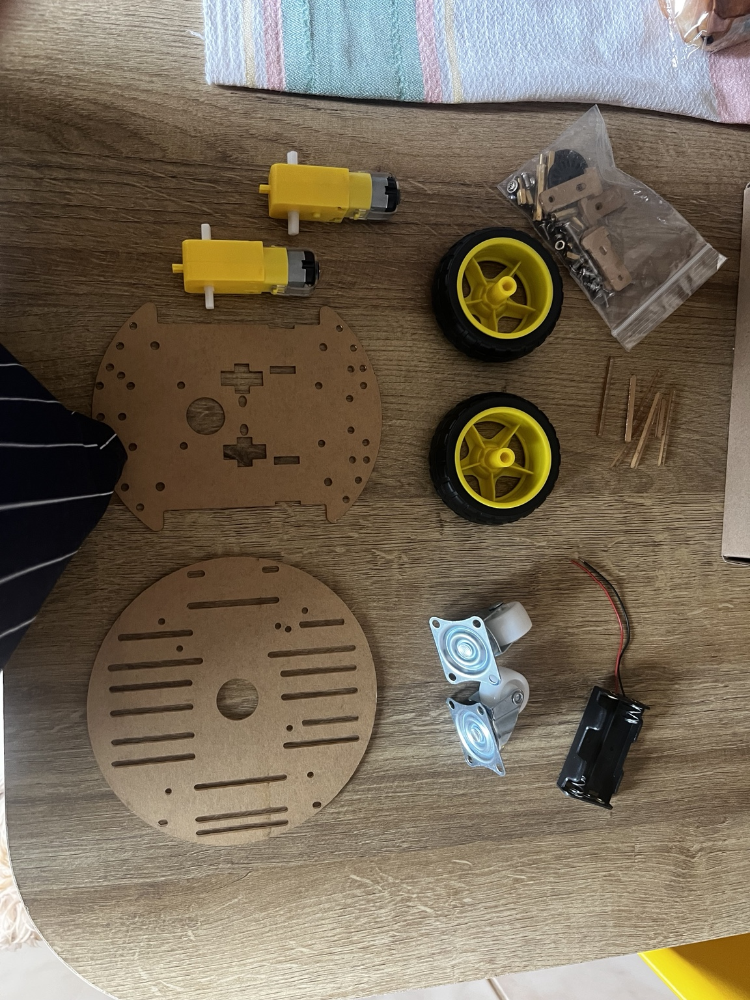
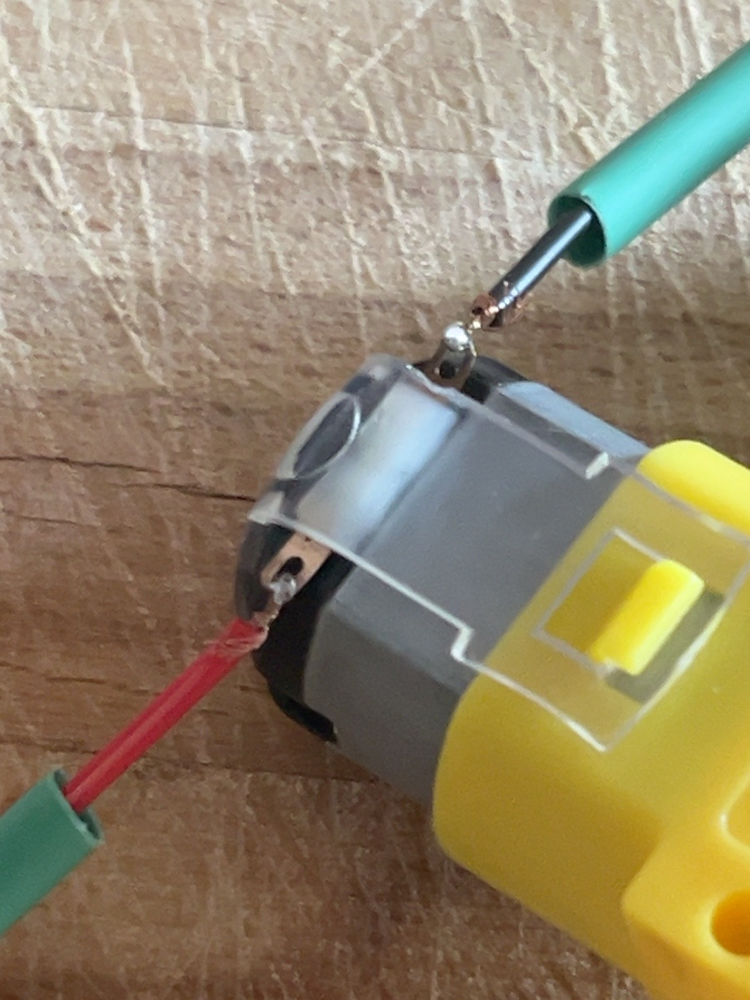
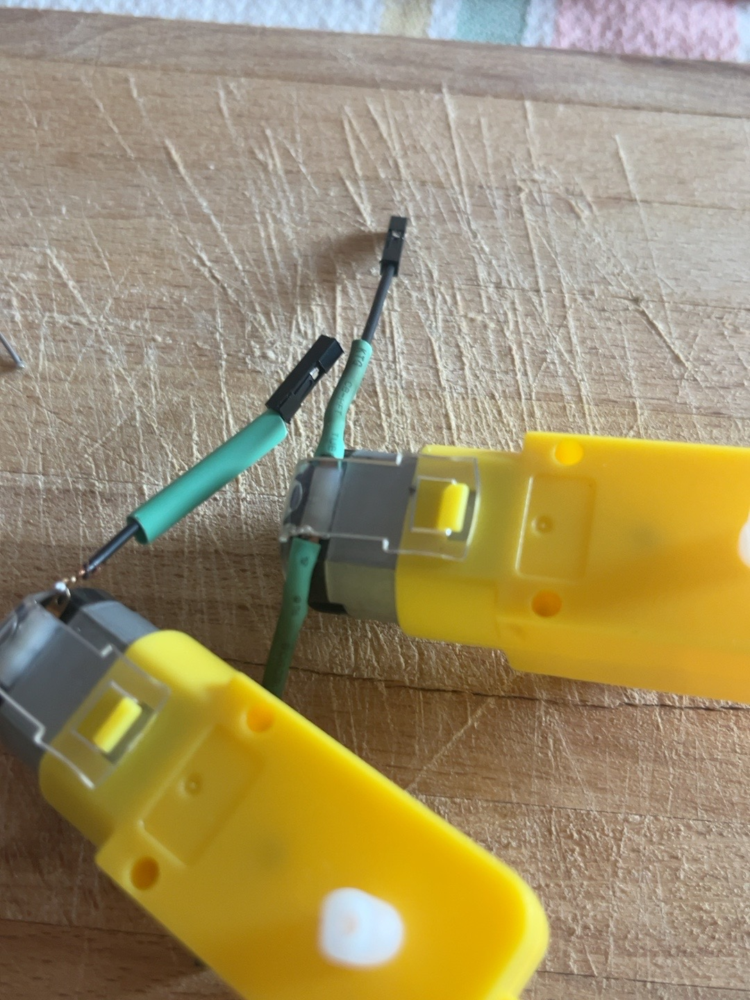
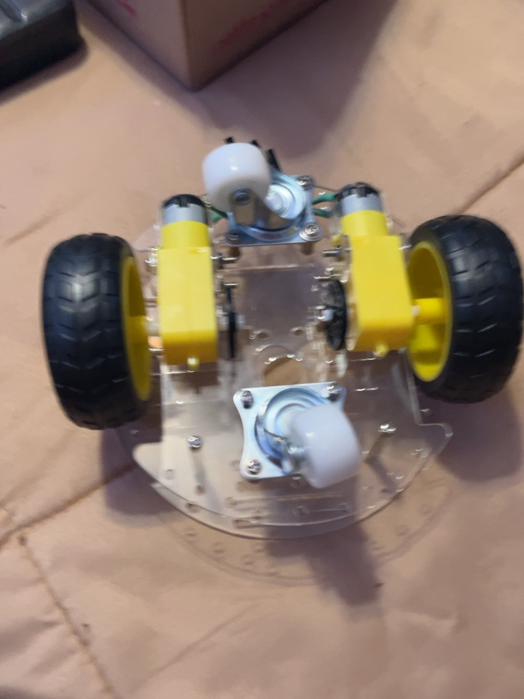
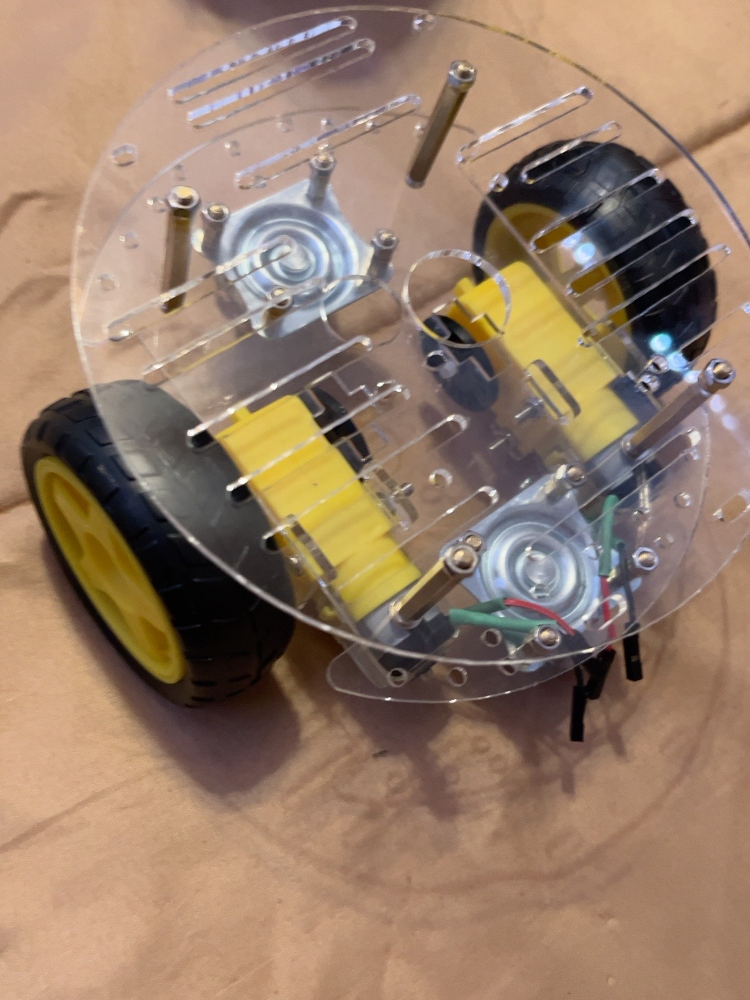

# Wittle Buddy 🤖

Wittle is a modular 2WD experimental mobile robot built from scratch to learn embedded systems, robotics, sensing, navigation, communications, mapping and autonomous behaviour—with room for a little personality along the way.

The main embedded controller / brain is an **Arduino Mega 2560**, programmed in object-oriented C++ using the Arduino framework and PlatformIO Core. This repository is the starting foundation, and will grow as hardware decisions and experiments become concrete.

## 🎮 First Wireless Drive

On **2026-09-06**, Wittle drove under fully wireless Xbox controller control for the first time. An assembled prototype became a remotely controllable mobile robot. 🤖

**Xbox Controller → Bluetooth → ESP32 → UART → Mega 2560 → Motor Driver → Motors**

### 🎥 [Watch Wittle's first wireless drive](docs/videos/001_mileStone001.mp4)

[**First drive: `001_mileStone001.mp4`**](docs/videos/001_mileStone001.mp4) — the footage lives in this repository; open the link to view or download it.

The **Mega 2560 remains Wittle's brain**: it owns motor control and the final command-timeout failsafe. The ESP32 is the wireless helper, interpreting Bluetooth controller input and sending signed left/right commands over UART. This drive proved the whole chain end-to-end, including both DC motors.

🔋 The wonderfully simple breakthrough for untethered power was a **USB power bank**, keeping the control electronics powered after disconnecting the computer. The motors kept their separate 4.5 V battery pack. This is a temporary prototype solution; see the [power debugging story](#power-debugging-a-small-power-bank-big-moment) and [milestone log](#milestone-log).

The current exp003 source maps the **right analog stick** (`axis_rx` / `axis_ry`), although the milestone description called it the left stick. The documentation follows the checked-in source mapping; see the [ESP32 experiment](experiments/esp32_xbox_controller/README.md#experiment-003-uart-motor-control) and [Mega wiring and failsafes](experiments/motor/README.md).

## Current status

**Body assembled:** the first 2WD chassis is built, with two acrylic decks, two geared DC motors and drive wheels, and two swivel casters. Motor leads have been attached, and the upper deck is in place for mounting electronics. See the [assembly photos](#body-assembly-ass001) below.

**Working on hardware:** Xbox-controlled wireless driving through the ESP32 → UART → Mega → dual motor driver → two DC motors, with portable control power from a USB power bank.

**Implemented:** a PlatformIO Mega firmware target, a lightweight experiment launcher, and a reusable `UltrasonicSensor` class. The active motor experiment (`exp003`) receives signed motor commands from the ESP32 over Serial1 with a 400 ms watchdog. The ultrasonic experiment remains available under `experiments/ultrasonic/`. The five subsystem classes remain skeletons with empty `begin()` and `update()` methods and are not instantiated. There are no automated tests yet.

**Planned:** reusable drive subsystem integration and encoder support, odometry and IMU integration, distance sensing, battery monitoring, communication with higher-level controllers, and a behaviour state machine.

**Experimental / future ideas:** 360-degree LiDAR integration, mapping, autonomous navigation, further ESP32 cooperation and expressive behaviours. These are exploration directions, not working capabilities or settled designs.

## Body assembly (ass001)

Wittle now has an assembled body. Photos 007–011 document the build from the loose chassis parts through motor lead preparation to the assembled base and upper deck.

The two motors and drive wheels are mounted to the lower chassis, with two swivel casters providing support. Standoffs separate the clear acrylic decks, leaving space for electronics. At this assembly stage, controller, motor-driver, sensor and power integration were still ahead. The first powered wireless drive is now recorded above; these photos preserve the earlier assembly milestone.

| Parts laid out | Motor terminal wiring | Motor leads prepared |
| --- | --- | --- |
|  |  |  |

| Assembled underside | Upper deck installed |
| --- | --- |
|  |  |

## Architecture

The working exp003 chain is **Xbox controller → Bluetooth → ESP32 → one-way UART → Mega 2560 → GPIO/PWM → dual motor driver → left/right DC motors**. Wireless input belongs to the ESP32; motor actuation and command validation/timeout belong to the Mega. This experiment is working, while the subsystem classes below remain planned integration boundaries.

| System | Planned responsibility |
| --- | --- |
| `DriveSystem` | DC motors and wheel encoders |
| `Navigation` | Odometry, IMU and pose/movement estimation |
| `Perception` | Ultrasonic, ToF and 360-degree LiDAR sensing |
| `PowerSystem` | Battery voltage monitoring and power state |
| `Communication` | Higher-level controllers, telemetry and commands |

`main.cpp` stays small. Future application orchestration and a behaviour state machine will coordinate these systems. The motor and ultrasonic experiments have defined pin assignments; broader robot wiring, protocols and timing contracts remain TBD. See [architecture](docs/architecture.md), [hardware inventory](docs/hardware.md) and [roadmap](docs/roadmap.md).

## Repository structure

```text
wittleBuddy/
├── README.md
├── platformio.ini
├── .vscode/extensions.json       # Optional PlatformIO IDE recommendation
├── docs/
│   ├── architecture.md
│   ├── hardware.md
│   ├── roadmap.md
│   ├── imgs/                     # Assembly and experiment photos
│   └── videos/                   # First wireless drive footage
├── include/                     # UltrasonicSensor.h and subsystem interfaces
├── src/                         # Launcher, UltrasonicSensor.cpp and subsystem skeletons
├── test/                        # Reserved for PlatformIO tests
└── experiments/                 # Implementations; selected experiment is built
    ├── motor/
    ├── esp32_xbox_controller/    # Separate ESP32 PlatformIO project
    ├── encoder/
    ├── ultrasonic/
    ├── tof/
    ├── servo/
    └── lidar/
```

PlatformIO makes `include/` available for headers. The root configuration sets `src_dir = .` and explicitly selects these implementation files with `build_src_filter`:

```ini
build_src_filter =
    +<src/main.cpp>
    +<experiments/motor/exp003.cpp>
```

This compiles the experiment in place, without copying it into `src/` or creating another project or environment. Other experiments and the subsystem skeletons are not compiled.

## Running experiments

`src/main.cpp` owns the Arduino `setup()` and `loop()` functions. It includes the experiment header and delegates to `motorExperimentSetup()` and `motorExperimentLoop()`. The implementation stays in `experiments/motor/exp003.cpp`.

The experiment starts both motors stopped, then receives `left,right` commands over Serial1 at 115200 baud. Positive commands use IN1 LOW / IN2 HIGH; a 400 ms command timeout stops both motors. See the [motor experiment README](experiments/motor/README.md) for wiring and bench-test instructions.

To activate a future experiment, keep its implementation and header under its own `experiments/` directory, update the header and calls in `src/main.cpp`, and replace the experiment path in `build_src_filter`. Explicitly include any reusable implementation files it needs. Keep Arduino entry points in `main.cpp`; no selector or registry is required.

## Development setup

Use Python 3 and [PlatformIO Core](https://docs.platformio.org/en/latest/core/installation/). A user-local installation keeps Python packages separate from Fedora's system Python:

```sh
python3 -m venv "$HOME/.platformio/penv"
"$HOME/.platformio/penv/bin/python" -m pip install platformio
export PATH="$HOME/.platformio/penv/bin:$PATH"
pio --version
```

On the initial development machine, Core is installed at that location, with `pio` and `platformio` links in `~/.local/bin` already on PATH. No system package or permission changes were needed. If another machine lacks Python or venv support, resolve its prerequisites before proceeding; do not run PlatformIO with sudo.

For VS Code, open this repository and optionally install the recommended **PlatformIO IDE** extension (`platformio.platformio-ide`). The CLI works independently in VS Code's terminal. Generated PlatformIO build and editor files are ignored by Git.

The board configuration follows the [PlatformIO Mega 2560 definition](https://docs.platformio.org/en/stable/boards/atmelavr/megaatmega2560.html). The Atmel AVR platform is pinned to version 5.3.0. PlatformIO downloads the compiler and Arduino framework on the first build; the uploader is fetched when needed. These downloads require internet access.

## Build, detect, upload and monitor

Run from the repository root:

```sh
pio run -e mega2560
pio device list
```

On the initial machine, USB ID `2341:0042` identifies the Mega 2560 R3 at `/dev/ttyACM0`. Device names can change after reconnecting; check the list before using the following commands.

**Upload only when you choose to replace the board's current firmware:**

```sh
pio run -e mega2560 -t upload --upload-port /dev/ttyACM0
```

For firmware that uses Serial, monitor output with:

```sh
pio device monitor -e mega2560 --port /dev/ttyACM0 --baud 115200
```

Exit the monitor with Ctrl+C and close it before uploading. The current motor experiment prints received commands and failsafe events over USB Serial at 115200; motor commands arrive separately on Serial1 RX pin 19. The startup message in the historical validation record below belongs to the earlier minimal firmware.

For serial access, inspect `id` and `ls -l /dev/ttyACM0`. On the initial Fedora machine the user is already in `dialout`, and the device is read/write for that group. No extra udev rules were needed for this connected board. Review any future permission change explicitly rather than granting world-writable access.

## Sensor refactor build validation (historical)

The sensor-class refactor passed `pio run -e mega2560`: flash usage was 2,348 / 253,952 bytes and RAM usage was 21 / 8,192 bytes. This verified compilation and linking; no firmware upload was performed during the refactor.

## Initial validation (historical)

On 2026-09-05, `pio run -e mega2560` succeeded on Fedora 44 with PlatformIO Core 6.1.19, Atmel AVR 5.3.0, AVR GCC 7.3.0 and Arduino AVR framework package 5.4.0. Flash usage was 1,856 / 253,952 bytes; RAM usage was 188 / 8,192 bytes. AVRDUDE 6.3 was installed separately through PlatformIO and its help command ran successfully. PlatformIO device enumeration and the monitor CLI were available.

The connected Arduino Mega 2560 at `/dev/ttyACM0` was successfully flashed using AVRDUDE. All 1,856 bytes were written and verified. After reset, serial communication at 115200 baud was verified with the exact startup output:

```text
Wittle Buddy starting up!
```

The received bytes were `b'Wittle Buddy starting up!\r\n'`. This confirms the minimal firmware runs and serial communication works; robot subsystems remain unimplemented. Serial access permissions were checked, and no system packages, group memberships or udev rules were changed.

## Power debugging: a small power bank, big moment

The ESP32 initially ran from the Mega's 5 V rail while the Mega was connected to USB. Removing the computer tether exposed a power problem:

| Attempt | What happened / lesson |
| --- | --- |
| Small rectangular 9 V battery → Mega external input → onboard regulator → Mega 5 V rail → ESP32 | The ESP32/controller setup became unreliable. The likely bottleneck was the small battery plus the Mega regulator supplying the combined Mega + ESP32 wireless load. |
| Motor battery pack (4.5 V) → ESP32 VIN/5V input | Also unsatisfactory. 4.5 V is marginal at the development board's VIN/5V input, and directly sharing motor power introduces voltage-drop and motor-noise concerns. |
| USB power bank → control electronics | Worked: portable regulated USB power kept the Mega/ESP32 system running with the computer disconnected. Motors retained their separate 4.5 V supply through driver VM, with common ground. |

After experimenting with a 9 V battery and the motor supply, the breakthrough power solution for the first untethered test was unexpectedly simple: **a USB power bank**. Sometimes the next robotics breakthrough is already in a drawer. 🔋

The unsuccessful arrangements were abandoned. These observations point to the power architecture; they are not measured regulator or noise diagnoses. The power bank is a **temporary prototype solution**, not a settled final design. A future main rechargeable battery with appropriate DC-DC regulation can supply the robot; that architecture has not been implemented.

## Milestone log

### 2026-09-06 — First wireless drive 🎮📡

1. Soldered the motor-driver header pins, brought the board online and debugged its wiring. Missing **VM motor power** explained why the motors initially would not move.
2. Successfully tested both DC motors. Both initially ran backwards; software direction was corrected and forward was experimentally confirmed as **AIN1/BIN1 LOW, AIN2/BIN2 HIGH**.
3. Connected the Xbox controller to the ESP32 over Bluetooth, implemented/tested ESP32 → Mega UART, and had the Mega translate wireless commands into motor movement.
4. Tried removing the USB tether with a small 9 V battery through the Mega and then the existing 4.5 V motor supply for the ESP32. Neither arrangement reliably powered the wireless setup.
5. Used a USB power bank as temporary portable 5 V control power, keeping the motors on their separate battery supply. Wittle completed its **first fully wireless Xbox-controlled drive**.
6. Recorded the first-drive footage, present here as [001_mileStone001.mp4](docs/videos/001_mileStone001.mp4) (called `Wittle001.mp4` in the session description).

This was the day Wittle moved beyond an assembled prototype and became a remotely controllable mobile robot. Hardware results above are from the reported driving session; implemented failsafes are documented separately from suggested bench checks.
